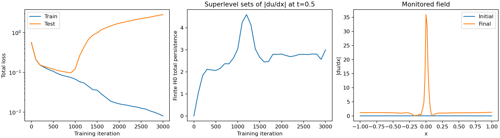

# Topological monitoring for DeepXDE

An experimental, optional callback that logs finite zero-dimensional persistence
of a predicted scalar field during training. It works with an ordinary DeepXDE
installation and adds no TDA runtime dependency. This is an independent proposal,
not an official DeepXDE feature.

## Install and import

With DeepXDE and a supported backend already installed:

```sh
python -m pip install git+https://github.com/j-garvi/deepxde-topological-monitor.git
```

```python
import numpy as np
from deepxde_topology import TopologicalFeatureMonitor

# For a model with one spatial input on [-1, 1]:
x_grid = np.linspace(-1, 1, 129)[:, None]
monitor = TopologicalFeatureMonitor(x_grid, grid_shape=(129,), period=100)
model.train(iterations=3000, callbacks=[monitor])
history = monitor.get_history()
```

`model` is your existing, compiled DeepXDE model. Choose evaluation points matching
its input dimensions. For a space-time model, add a time column; see the example.
Importing does not change DeepXDE or start monitoring automatically.

Alternatively, copy `deepxde_topology.py` beside your training script and use the
same import. There is no need to install a modified DeepXDE checkout.

## What it records

Each row contains `step`, `num_features`, `total_persistence`, and
`max_persistence`. A finite H0 feature is a connected component born at one
threshold and merged into an older component at another threshold. The component
that survives forever is excluded; in a superlevel filtration this includes the
component born at the global maximum. A constant field and a field with a single
surviving basin can both have zero finite features.

The scalar field is selected by `component=0` or by an `operator` accepted by
`Model.predict`. Operators must return an array of shape `(N,)` or `(N, C)`;
for PDEs returning a list of residuals, wrap the operator to select one residual.
`superlevel=True` monitors peaks by negating the field. `normalize=True` divides
by maximum absolute field value; this is amplitude normalization, not min-max
normalization. `min_persistence` removes lifetimes less than or equal to that
threshold, after optional normalization. `filename` writes rows to a text file
instead of stdout; close `monitor.file` when finished using a file-backed monitor.

## Burgers example

Clone this repository, install it with `python -m pip install .`, and run:

```sh
DDE_BACKEND=pytorch python examples/burgers_monitor.py --iterations 3000
```

The example solves viscous Burgers with initial condition `u(x,0)=-sin(pi*x)`
and zero boundary values on `[-1,1]`. It monitors superlevel persistence of
`|du/dx|` on a fixed 129-point spatial slice at `t=0.5`, with a lifetime threshold
of 0.05 in the unnormalized gradient units.

The resulting plot places training/test loss alongside the persistence trace and
the initial/final monitored field. Components here describe separated regions
of large gradient, including possible boundary features. A descriptor change
shows how these regions appear and merge as the threshold changes. It does not
establish that a shock is physically correct or that the solution has converged.
This small example is a usage demonstration, not a solver-accuracy benchmark.
With the fixed, sparse collocation points used here, the test residual can rise
while training loss falls. A topology trace does not resolve that failure; inspect
the test loss and improve sampling/validation before trusting the solution.

Outputs in `example-output/` include the plot, raw descriptor log and a JSON
summary. The timing summary measures time spent inside monitor evaluations as
a fraction of the full training call, including initial and final evaluations.
It is instrumentation of one run, not a controlled estimate of slowdown.

### Recorded example run



The [recorded run](examples/reference_run/summary.json) uses DeepXDE 1.15.0,
PyTorch, seed 17, and 3,000 Adam iterations. Total training loss fell from 0.568
to 0.00806, while total test loss rose from 0.567 to 2.846. The finite-feature
count changed from 0 to 5. These are descriptive observations of this run, not
proof that the final topology is correct. Monitor evaluations took about 0.053 s
out of a 20.46 s training call (0.26%); timings depend on hardware and workload.

## Scope and limitations

- Only finite H0 on regular 1D/2D grids; no H1, periodic wrapping, masks or meshes.
- Samples are treated as top-dimensional closed cubical cells: in 2D, cells
  touching at a corner connect (eight neighbors). This matches GUDHI's
  `CubicalComplex(top_dimensional_cells=field)`, not its vertex-value convention.
- Arrange inputs in C-order for `grid_shape`. Grid geometry/order is the user's
  responsibility. For 2D, use `meshgrid(..., indexing="ij")` then C-order ravel.
- Counts depend on resolution, noise and threshold. The three summaries discard
  feature locations and much of the persistence diagram; different fields can
  produce the same summaries. They complement residual/error checks.
- `period` is a minimum iteration interval, checked at epoch-end hooks. Optimizers
  can advance many iterations per hook; missing intermediate checks are not
  reconstructed. TensorFlow external-optimizer paths without these hooks receive
  start/end monitoring only. Final-step changes are always recorded.
- Each training call records its initial state; reusing a callback appends history.
- Plain predictions use `Model.predict`. Derived operators inherit its backend
  limitations. Integration tests currently exercise PyTorch, not all backends.
- NumPy sorting plus a union-find sweep runs on CPU; large grids may be expensive.

## Tests

```sh
python -m pip install '.[test]'
DDE_BACKEND=pytorch python -m pytest -q
```

Includes lifecycle regression tests, real training with an output and derivative
monitor, and 800 randomized comparisons against GUDHI (test dependency only).

## Research context and license

Motivated by J. Garví-Gualda, *Topological validation of neural PDE solvers:
pointwise error metrics cannot certify derived structure* (2026),
[Zenodo](https://doi.org/10.5281/zenodo.21707631).
This package implements only the standard cubical H0 computation used by the
monitor. It does not claim a new persistence algorithm or a correctness certificate.

LGPL-2.1; see LICENSE. Uses [DeepXDE](https://github.com/lululxvi/deepxde)'s public
callback interface. A matching draft integration is maintained separately for
discussion with upstream maintainers.
